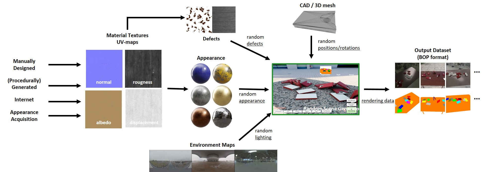

# CAD2Render - A Modular Toolkit for GPU-accelerated Photorealistic Synthetic Data Generation for the Manufacturing Industry
<p align="center">
  
  
</p>

**CAD2Render** is a highly customizable framework for generating high quality synthetic data for deep learning purposes. It is build upon the high definition rendering pipeline of unity for high quality raytracing with full global illumination. The framework supports variations in model types, number of models, environments, viewpoints, exposure, supporting structures, materials,  material colors, etc.

If you publish a scientific paper that is based on (or makes use of) CAD2Render, you must cite the following conference publication:

> Steven Moonen, Bram Vanherle, Joris de Hoog, Taoufik Bourgana, Abdellatif Bey-Temsamani and Nick Michiels. AD2Render: A Modular Toolkit for GPU-Accelerated Photorealistic Synthetic Data Generation for the Manufacturing Industry. Proceedings of the IEEE/CVF Winter Conference on Applications of Computer Vision (WACV) Workshops. Pages 583-592. January, 2023.

Be sure to [check out this publication](https://openaccess.thecvf.com/content/WACV2023W/PIES-CV/html/Moonen_CAD2Render_A_Modular_Toolkit_for_GPU-Accelerated_Photorealistic_Synthetic_Data_Generation_WACVW_2023_paper.html) if you want to know more about e.g. the CAD2Render implementation.


**CAD2Render** will be presented at the Workshop on **Photorealistic Image and Environment Synthesis for Computer Vision (PIES-CV)** in conjunction with **IEEE/CVF WACV 2023**.

<p align="center">
  
</p>

## Installation
A tutorial for instaltion and other features is provided on [youtube](https://www.youtube.com/playlist?list=PLDC58CxYwFZ73zdWx70gcxIli1kCc5fV4)

Clone the latest stable release from this repository: [v3.0](https://github.com/EDM-Research/CAD2Render/releases/tag/v3.0).

This release includes four example scenes and a couple of basis models, environment maps and materials:
- Assets/publicProjects/newScene/template.unity
- Assets/publicProjects/BusinessCards/BusinessCardHolderNew
- Assets/publicProjects/DemoRotor/RotorDemo.unity
- Assets/publicProjects/RobojobPaper/robojob_import.unity

### Requirements
Unity Version [2021.2.0b1](https://unity3d.com/unity/beta/2022.2.0b1) or higher.
 
NVIDIA RTX series card with the latest drivers [here](https://www.nvidia.com/Download/index.aspx?lang=com) Windows 10 RS5 (Build 1809) or later
Ray tracing hardware acceleration is only available on certain graphics cards.

The graphics cards with full support are:
NVIDIA Volta (Titan X)
NVIDIA Turing RTX (2060, 2070, 2080, and their TI variants)
NVIDIA Ampere RTX (3060, 3070, 3080, 3090, and their TI variants)

NVIDIA also provides a ray tracing fallback for some other generation graphics cards:
NVIDIA Turing GTX (1660 and 1660 Ti)
NVIDIA Pascal (1060, 1070, 1080 and their TI variants)

If your computer has one of these graphics cards, it can run ray tracing in Unity.
Before you open Unity, make sure to update your NVIDIA drivers to the latest version, and also make sure your Windows version is at least 1809.

Check [here](README_viewRandomizer.md) for more limitations of the software.


## Additional environment maps and surface materials
Standards, only a couple of example environments and surface materials are included to keep the repository clean. The user can manually add the following resources:
- HDR environment maps in exr format with at least a resolution of 2500x2500
- High definition unity materials. For example: [Unity's Measured Material Library HDRP](https://github.com/Unity-Technologies/MeasuredMaterialLibraryHDRP)
The user can add the resources above to the Unity project by copying them somewhere in the *Assets/privateResources* folder. 

In the light dataset settings asset, the path to the new environments and/or materials should be updated.

## How to use
### Setting up the scene
Make a copy of the template scene in *Assets/pubicResources/NewScene* and rename it.
A scene consists of the following main parts:
- **Main Camera**: The main camera that is controlled by the framework. Each variation in viewpoint will alter this main camera. Here the settings of the camera are stored. Like the focal lenght, sensor size etc.
- **Environment**: Contains the raytracing, rendering and post processing settings. These settings can be overwriten with the Generator.
- **Custom Pass**: Controlls the rendering of normal maps, depth maps, segmentation maps and normal maps. No changes should be made to this object.
- **Generator**: This is the object that conrtolls all the randomizers to trigger and save the end results.
- **GUI**: Contains the main GUI interface. The buttons are linked to randomizers in the generator. No changes should be made to this object.


### Setting up parameters for the generator
There are multiple randomizer types that can be added to the generator
- **Generator**: This object manages the settings that control the other randomizers and the export settings. Only one should exist in a scene.</br>See [here](README_mainRandomizer.md) for a detailed explanation of the possible settings.
- **View**: Here the settings for the randomizations of the camera are stored. Only one should exist in a scene.</br>See [here](README_viewRandomizer.md) for a detailed explanation of the possible settings.
- **Light**: This object manages the settings that control the environment and any extra lights. Multiple instances can be created to support multiple extra lights. </br>See [here](README_lightRandomizer.md) for a detailed explanation of the possible settings.
- **Material**: This object manages the settings that control the material properties of an object. Every static object in the scene can have its own material randomizer.</br>See [here](README_materialRandomizer.md) for a detailed explanation of the possible settings.
- **Object**: This object manages the settings that control the spawning of new objects. A material randomizer must be linked that will be added to every object spawned with this object randomizer. Multiple object randomizers are supported.</br>See [here](README_objectRandomizer.md) for a detailed explanation of the possible settings.

## Citation
```
@InProceedings{Moonen_2023_WACV,
    author    = {Moonen, Steven and Vanherle, Bram and de Hoog, Joris and Bourgana, Taoufik and Bey-Temsamani, Abdellatif and Michiels, Nick},
    title     = {CAD2Render: A Modular Toolkit for GPU-Accelerated Photorealistic Synthetic Data Generation for the Manufacturing Industry},
    booktitle = {Proceedings of the IEEE/CVF Winter Conference on Applications of Computer Vision (WACV) Workshops},
    month     = {January},
    year      = {2023},
    pages     = {583-592}
}
```
