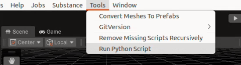
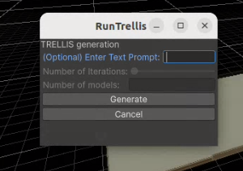
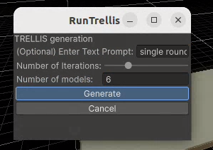

# 3D asset generation

In the context of the NormAI project, we add functionality to generate 3D models and prefabs in Unity. For now, it uses TRELLIS.2 as the method to generate 3D models from 2D image input. Input images can be existing images on the computer, made on the spot with a webcam or generated with a text prompt. 

## RunTrellis usage

`Assets/Editor/RunTrellis.cs` script adds new functionality to the engine. In Unity, go to tools then select Run Python Script and you will be presented with small editor window.

In there, you can optionally enter a text prompt which will be used to generate input images. If you enter a prompt, you can choose how many iterations you want (i.e. number of images/ models to generate). With no prompt, this script will always generate only 1 model at a time.

If you leave the prompt empty, you will be prompted to select an existing image from your computer. If you do not select any image, you will have the possibility to take pictures using your webcam. If using the webcam option, press `S` to capture an image then `P` to start generating the 3D model with Trellis. You can cancel by pressing `Q`.

> [WARNING]
> Multi-image input is currently not very well supported in TRELLIS.2.

You can use `Assets/publicProjects/Trellis2Demo` as a first test environment. You can change the prefabs to spawn for the simulation with CAD2Render in `Assets/publicProjects/Trellis2Demo/DIMO_Objects_1.asset`. Once the models and prefabs are generated, you can find them in `Assets/Resources/privateResources/Trellis`. Each generation instruction will create a new subdirectory and increment the number (e.g. there are 4 directories and you generate 5 models at once, there will be a new directory `4` with 5 in `models` and `prefabs`).

For debug and test purposes, image input, prompt information, raw model and textured model can be found in `../TRELLIS.2-tests`.

## Dependencies

Previous script can only work if [TRELLIS.2](https://github.com/microsoft/TRELLIS.2), and optionally [Wan2GP](https://github.com/deepbeepmeep/Wan2GP) for image generation with text prompt, are properly installed. By default, they should be installed at `../TRELLIS.2` and `../Wan2GP`.

For TRELLIS.2, add the scripts [`README_resources/trellisScript/TRELLIS.2/app_unity.py`](README_resources/trellisScript/TRELLIS.2/app_unity.py) and [`README_resources/trellisScript/TRELLIS.2/app_unity.sh`](README_resources/trellisScript/TRELLIS.2/app_unity.sh) in the root folder, and follow additional instructions in [`README_resources/trellisScript/TRELLIS.2/notes.txt`](README_resources/trellisScript/TRELLIS.2/notes.txt).

For Wan2GP, add the scripts [`README_resources/trellisScript/Wan2GP/wgp_unity_queue.py`](README_resources/trellisScript/Wan2GP/wgp_unity_queue.py) and [`README_resources/trellisScript/Wan2GP/wgp_unity.sh`](README_resources/trellisScript/Wan2GP/wgp_unity.sh) in the root folder. 

## Future work

- Try [Hunyuan3D](https://github.com/Tencent-Hunyuan/Hunyuan3D-2) or [Sam3D](https://sam3d.org/) to generate 3D models instead of Trellis to see if results improve.
- Try [manex3d](https://manex3d.com/multi-image-to-3d-model) or [meshy](https://www.meshy.ai/blog/convert-images-to-3d-model) for example to generate 3D models using multi-view constitent images as input instead of a single image for improved results.

Ideas to explore:
- more complex, leafy objects
- explicit vs implicit modelling
- radiance fields and relighting
- novel synthesis for the trees
- geometric variation and interpolation
- GenAI, morphing, 2D to 3D model variation
- multi-view consistent variation
- image augmentation (MakeReal)
- photogrametry together with gaussian splatting
- skeletal extraction
- use videos as input instead of images